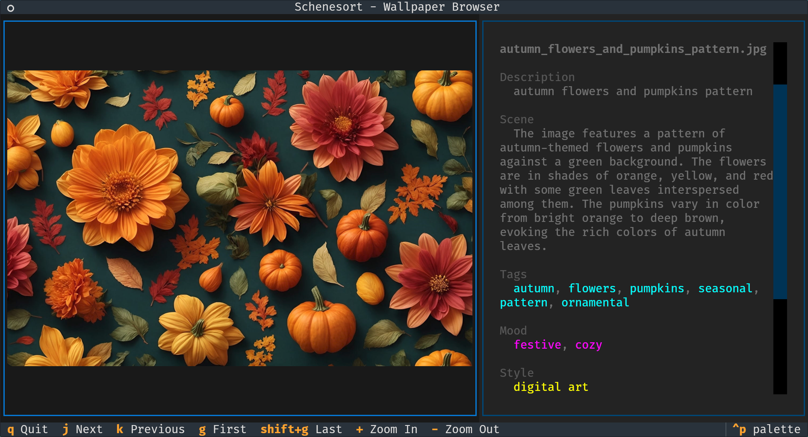
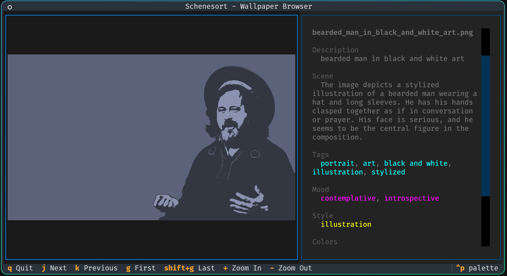

# Schenesort v2.2.0

A CLI tool for managing wallpaper collections with model generated metadata, terminal UI browsing, and SQLite-based
querying.

schenesort takes a directory of random wallpapers, with random filenames, and uses olama with a decent vision model to
- look at each wallpaper
- rename the wallpaper to something sensible
- drop a XMP sidecar with metadata about the file

Once you have a collection of wallpapers re-named with metadata sidecars, run the indexer over it to create a sqlitedb
that can be queried to retrieve suggestions based on tags, colours, names and the like. Then use `get` to get a
wallpaper path `feh $(schenesort get -1 -p)` or `hyprctl hyprpaper wallpaper "eDP-1,$(schenesort get -1 -p)"`


## Installation

```bash
uv tool install schenesort
```

For development:

```bash
git clone https://github.com/sthysel/schenesort.git
cd schenesort
uv sync
```

## Quick Start

To generate metadata you need a olama server serving llava nearby, it takes a minute to set one up see [ollama
setup](./ollama-setup.md).

```bash
# Generate metadata for images
schenesort metadata generate ~/wallpapers -r

# Browse with TUI
schenesort browse ~/wallpapers

# Index the collection
schenesort index ~/wallpapers

# Query wallpapers
schenesort get --mood peaceful --screen 4K
schenesort get -1 -p | xargs feh  # random wallpaper
```

## Commands

| Command                      | Description                                         |
|------------------------------|-----------------------------------------------------|
| `browse`                     | Terminal UI browser with image preview and metadata |
| `index`                      | Build SQLite index for fast querying                |
| `get`                        | Query wallpapers by metadata attributes             |
| `stats`                      | Show collection statistics from index               |
| `config`                     | Show or create configuration file                   |
| `sanitise`                   | Rename files to Unix-friendly format                |
| `validate`                   | Check image extensions match file content           |
| `cleanup`                    | Delete orphaned XMP sidecars                        |
| `info`                       | Show collection file statistics                     |
| `describe`                   | AI-rename images based on content (Ollama)          |
| `models`                     | List available Ollama models                        |
| `metadata show`              | Display XMP sidecar metadata                        |
| `metadata set`               | Manually set metadata fields                        |
| `metadata generate`          | Generate metadata with AI (Ollama)                  |
| `metadata update-dimensions` | Add image dimensions to existing sidecars           |
| `metadata embed`             | Embed sidecar data into image files                 |

## Terminal UI Browser

Browse your wallpaper collection with image preview and metadata display:

```bash
schenesort browse ~/wallpapers
schenesort browse ~/wallpapers -r  # recursive
schenesort browse                  # uses paths.wallpaper from config
schenesort get --mood peaceful -b  # browse query results
```





**Keyboard shortcuts:**
| Key          | Action         |
|--------------|----------------|
| `j` / `Down` | Next image     |
| `k` / `Up`   | Previous image |
| `g` / `Home` | First image    |
| `G` / `End`  | Last image     |
| `+` / `-`    | Zoom in/out    |
| `q`          | Quit           |

The TUI uses textual-image for rendering, which auto-detects terminal graphics support (Sixel, iTerm2, Kitty).

## Collection Indexing and Querying

Build a SQLite index for fast querying across your entire collection:

```bash
# Build/update the index
schenesort index ~/wallpapers
schenesort index ~/wallpapers --rebuild   # rebuild from scratch
schenesort index ~/wallpapers --prune     # remove deleted files

# Query wallpapers
schenesort get --tag cyberpunk
schenesort get --mood peaceful --style photography
schenesort get --screen 4K --subject landscape
schenesort get --color blue --time sunset
schenesort get --min-width 3840
schenesort get -q "mountain"              # text search

# Random selection
schenesort get --random -n 10             # 10 random wallpapers
schenesort get -1                         # single random wallpaper
schenesort get -1 --mood dramatic         # random with filter

# Browse results in TUI
schenesort get --mood peaceful --browse   # open matches in browser
schenesort get --style photography -b     # short form

# For scripting (paths only)
schenesort get -1 -p                      # just the path
feh $(schenesort get -1 -p)               # set random wallpaper
hyprctl hyprpaper wallpaper "eDP-1,$(schenesort get -1 -p)"

# View collection stats
schenesort stats
```

The database is stored at `$XDG_DATA_HOME/schenesort/index.db` (default: `~/.local/share/schenesort/index.db`).

## Metadata Management

Store metadata in XMP sidecar files (`.xmp`) alongside images without modifying the original files.

### Metadata Fields

| Field                | Description                                              |
|----------------------|----------------------------------------------------------|
| `description`        | Short description (used for filenames)                   |
| `scene`              | Detailed scene description                               |
| `tags`               | Keywords/tags                                            |
| `mood`               | Visual mood (peaceful, dramatic, mysterious, etc.)       |
| `style`              | Art style (photography, digital art, illustration, etc.) |
| `colors`             | Dominant colors                                          |
| `time_of_day`        | Time depicted (day, night, sunset, etc.)                 |
| `subject`            | Primary subject (landscape, urban, nature, etc.)         |
| `width` / `height`   | Image dimensions in pixels                               |
| `recommended_screen` | Best screen size (4K, 1440p, 1080p, etc.)                |
| `source`             | Source URL or info                                       |
| `ai_model`           | Model used for metadata generation                       |

### Generate Metadata using ollama

```bash
# Preview what would be generated
schenesort metadata generate ~/wallpapers --dry-run

# Generate metadata and rename files
schenesort metadata generate ~/wallpapers -m llava

# Generate without renaming
schenesort metadata generate ~/wallpapers --no-rename

# Overwrite existing metadata
schenesort metadata generate ~/wallpapers --overwrite

# Use remote Ollama server
schenesort metadata generate ~/wallpapers --host http://server:11434
```

### Update Dimensions Only

Add dimensions to existing sidecars without re-running AI inference:

```bash
schenesort metadata update-dimensions ~/wallpapers -r
```

### Manual Metadata

```bash
# Show metadata
schenesort metadata show image.jpg

# Set fields manually
schenesort metadata set image.jpg -d "Mountain sunset landscape"
schenesort metadata set image.jpg -t "nature,sunset,mountains"
schenesort metadata set image.jpg -a "peaceful"  # add tag
schenesort metadata set image.jpg -s "https://unsplash.com/..."
```

### Embed into Image Files

Write metadata directly into images (requires `exiftool`):

```bash
schenesort metadata embed ~/wallpapers -r
```

## Filename Sanitation

The `sanitise` command makes filenames Unix-friendly:

```bash
schenesort sanitise ~/wallpapers --dry-run
schenesort sanitise ~/wallpapers -r
```

| Rule                        | Example                             |
|-----------------------------|-------------------------------------|
| Lowercase                   | `HelloWorld.JPG` → `helloworld.jpg` |
| Spaces → underscore         | `my file.jpg` → `my_file.jpg`       |
| Remove punctuation          | `file(1)!.jpg` → `file1.jpg`        |
| Collapse underscores        | `a___b.jpg` → `a_b.jpg`             |
| Strip leading/trailing `_-` | `_file_.jpg` → `file.jpg`           |

## Cleanup Orphaned Sidecars

Delete XMP sidecar files that have no corresponding image:

```bash
schenesort cleanup ~/wallpapers --dry-run
schenesort cleanup ~/wallpapers -r
```

## Configuration

Schenesort follows XDG Base Directory spec:
- Config: `$XDG_CONFIG_HOME/schenesort/config.toml` (default: `~/.config/schenesort/config.toml`)
- Data: `$XDG_DATA_HOME/schenesort/index.db` (default: `~/.local/share/schenesort/index.db`)

```bash
# Show current config
schenesort config

# Create default config file
schenesort config --create
```

Config file format:

```toml
[ollama]
# Ollama server URL (leave empty for localhost:11434)
host = "http://server:11434"

# Default vision model
model = "llava:13b"

[paths]
# Default wallpaper collection path
wallpaper = "~/wallpapers"
```

Command-line options override config file settings.

## Ollama Setup (Arch Linux)

```bash
# Install
yay -S ollama ollama-cuda  # for NVIDIA GPU

# Start service
sudo systemctl enable --now ollama

# Pull a vision model
ollama pull llava           # ~4GB
ollama pull llava:13b       # ~8GB, better quality

# List available models
schenesort models
```

## Yazi Plugin

A [Yazi](https://yazi-rs.github.io/) previewer plugin that displays XMP metadata alongside image previews.

### Installation

```bash
# Copy plugin
mkdir -p ~/.config/yazi/plugins/schenesort.yazi
cp schenesort.yazi/main.lua ~/.config/yazi/plugins/schenesort.yazi/

# Install exiftool config for custom namespace
mkdir -p ~/.config/ExifTool
cp schenesort.yazi/schenesort.config ~/.config/ExifTool/

# Install exiftool
sudo pacman -S perl-image-exiftool  # Arch
```

Add to `~/.config/yazi/yazi.toml`:

```toml
[plugin]
prepend_previewers = [
    { mime = "image/*", run = "schenesort" },
]
```

See [schenesort.yazi/README.md](schenesort.yazi/README.md) for details.

## XMP Sidecar Format

```
~/wallpapers/
├── mountain_sunset.jpg
├── mountain_sunset.jpg.xmp   ← metadata stored here
├── cyberpunk_city.png
└── cyberpunk_city.png.xmp
```

Metadata is stored in standard XMP format, compatible with digiKam, darktable, and Lightroom.

## Screen Size Recommendations

Images are tagged with recommended screen sizes based on resolution:

| Screen          | Resolution |
|-----------------|------------|
| 8K              | 7680x4320  |
| 5K              | 5120x2880  |
| 4K              | 3840x2160  |
| Ultrawide 4K    | 5120x2160  |
| Ultrawide 1440p | 3440x1440  |
| 1440p           | 2560x1440  |
| 1080p           | 1920x1080  |
| 720p            | 1280x720   |

An image is recommended for a screen size if it can cover the screen without upscaling.
